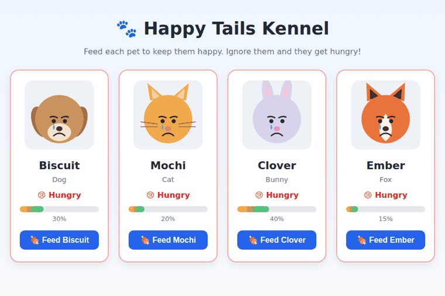
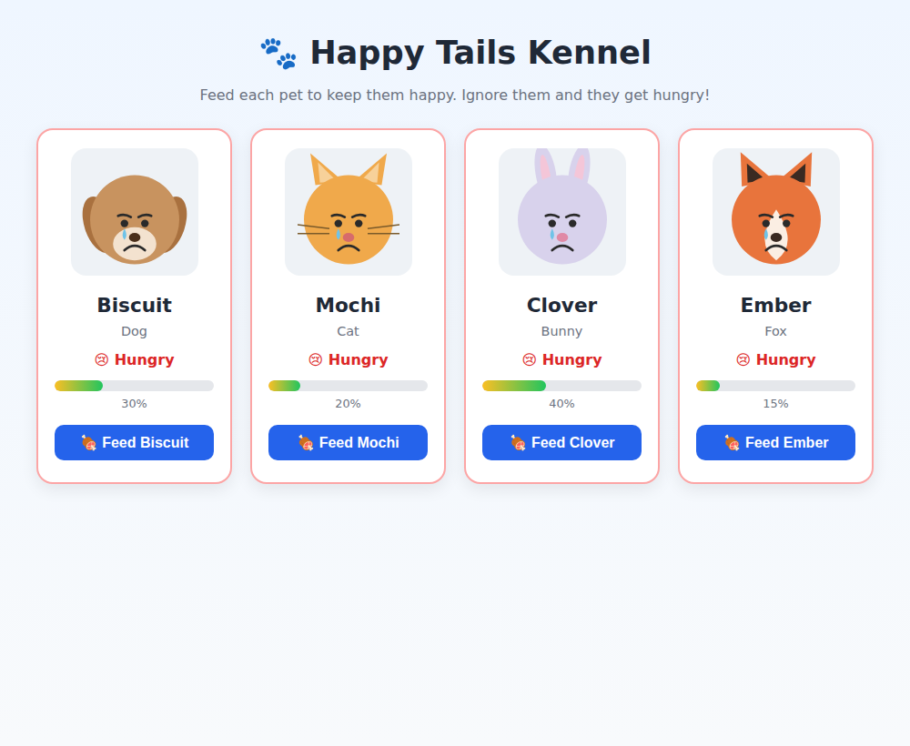
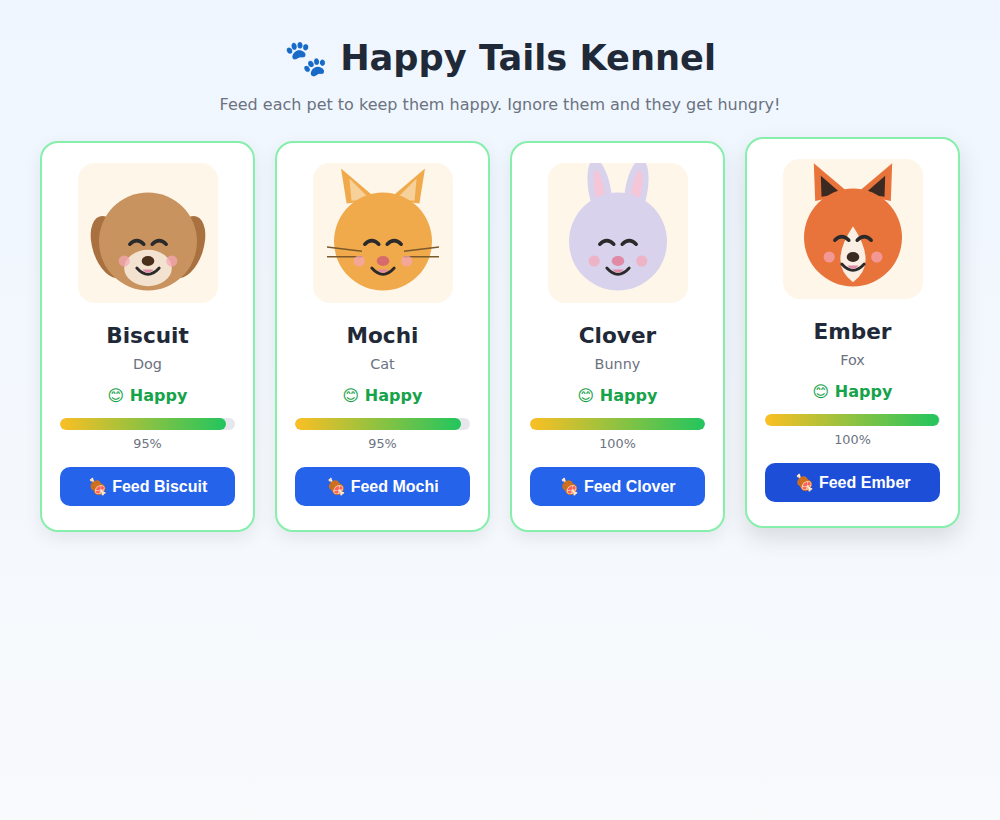

# 🐾 Happy Tails Kennel

An interactive React app for keeping track of the pets in a kennel and how happy
each one is. Every pet shows a **happy or sad face** depending on its happiness
level — click the **Feed** button to cheer a pet up, and watch them slowly get
hungry again if you ignore them.

This project was built for the class assignment on **class-based React
components**, and demonstrates state, props, callback functions, and rendering a
list with `.map()`.

---

## Demo



*Pets start hungry, feeding flips them to happy, and they get hungry again over time.*

---

## Screenshots

**Hungry pets (before feeding):**



**Happy pets (after feeding):**



---

## Features

- Four pets, each with its own **happy** and **sad** image.
- A **happiness meter** (0–100%) on every card.
- A **Feed** button that raises a pet's happiness (`+25` per click).
- Pets get **hungry over time** — a timer slowly lowers happiness so pets drift
  from happy back to sad if left alone.
- State lives in the parent (`App.jsx`) and flows down to each card through props.

---

## How it works (assignment requirements)

| Requirement | Where |
|---|---|
| **State** initialized from `data.js` | `App.jsx` constructor sets `this.state = { pets: initialData }` |
| **Mapping** with `.map()` to render cards | `App.jsx` `render()` maps `this.state.pets` into `ChildComponent`s |
| **Event method** in the parent, passed via props | `App.jsx` `feedPet(id)` is passed to each child as the `onFeed` prop |
| **Child logic** — display props + trigger the parent method | `ChildComponent.jsx` shows the props and calls `this.props.onFeed(this.props.id)` on click |

The parent decides each pet's mood from its happiness (`>= 50` = happy) and
passes the matching image and status down, so the child stays purely
presentational. The hunger timer uses the `componentDidMount` and
`componentWillUnmount` lifecycle methods.

---

## Getting Started

**Prerequisites:** Node.js v18+ and npm.

```bash
# 1. Clone your fork
git clone <your-fork-url>
cd petKennel

# 2. Install dependencies
npm install

# 3. Start the dev server
npm run dev
```

Vite defaults to **http://localhost:5173** — check your terminal for the exact
URL.

### Other commands

```bash
npm run build     # production build into dist/
npm run preview   # preview the production build
npm run lint      # run ESLint
```

---

## Usage

1. Open the app in your browser.
2. Each card shows a pet, its species, a happiness meter, and its current mood.
3. Pets start out **hungry** (sad face, red status).
4. Click **🍖 Feed [name]** to raise that pet's happiness — at 50% or higher the
   pet switches to its **happy** face.
5. Stop feeding and the pets slowly get hungry again.

---

## Running with Docker

```bash
docker-compose up --build   # available at http://localhost:3000
docker-compose down
```

---

## Project Structure

```
src/
├── App.jsx            # Parent class component — state + feedPet() method
├── ChildComponent.jsx # Pet card — displays props, fires onFeed on click
├── data.js            # Pet data + happy/sad image imports
├── App.css            # Card and layout styles
├── index.css          # Base page styles
└── assets/pets/       # Self-contained happy/sad SVG images (dog, cat, bunny, fox)
scripts/
└── generate_pets.py   # Script used to generate the pet SVGs
docs/                  # Screenshots for this README
```

The pet images are plain **SVG files** generated by `scripts/generate_pets.py`,
so the app renders correctly with no external image URLs or network connection.

---

## Technologies Used

- [React 19](https://react.dev/) (class components)
- [Vite 7](https://vitejs.dev/)
- [Node.js](https://nodejs.org/)
- Plain CSS
- SVG for the pet artwork
- [Docker](https://www.docker.com/) _(optional)_

---

## License

[MIT](https://choosealicense.com/licenses/mit/)
